# Cybersecurity Homelab Setup Documentation

## Overview

This document outlines the process of building a cybersecurity homelab using virtualization technology. The homelab serves as a controlled environment for practicing penetration testing, security tool evaluation, and hands-on cybersecurity experimentation without risking production systems.

## Project Goals

- **Learn Virtualization**: Understand hypervisor technology and VM management
- **Practice with Kali Linux**: Gain hands-on experience with industry-standard penetration testing tools
- **Build an Isolated Lab**: Create a contained environment for secure security testing
- **Develop Infrastructure Skills**: Learn system administration and network configuration fundamentals
- **Prepare for Cybersecurity Roles**: Build practical knowledge for SOC analyst and penetration tester positions

## Architecture & Technology Stack

### Host Environment
- **Hypervisor**: UTM (macOS Virtualization Framework)
- **Host OS**: macOS 12+
- **Virtualization Engine**: QEMU (recommended over Apple Virtualization for stability and compatibility)

### Virtual Machine Configuration
- **Guest OS**: Kali Linux 2026.1 (ARM64 architecture)
- **VM Name**: HomeLab_1
- **System Type**: QEMU 10.0 ARM Virtual Machine
- **Allocated Resources**:
  - RAM: 6 GB
  - CPU Cores: Default (all available cores)
  - Storage: 64 GB
  - Display: Enabled with full graphics support
  - Terminal: Configurable with custom fonts and themes

### Desktop Environment
- **Display Manager**: GNOME Display Manager (GDM3)
- **Desktop Environment**: Xfce (lightweight, performance-optimized for VMs)

## Installation Process

### Step 1: Operating System Selection

First step is selecting the guest operating system for the virtual machine:

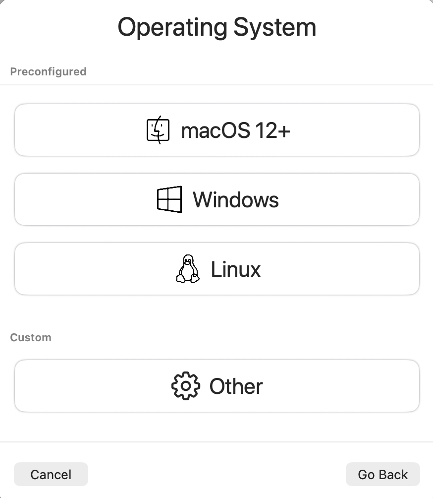

Kali Linux was selected from the available options for its industry-standard penetration testing toolset.

### Step 2: Virtualization Setup
1. Selected **QEMU** as the virtualization engine over Apple Virtualization
   - Provides better compatibility with Kali Linux ARM builds
   - More mature ecosystem and community support
   - Easier troubleshooting and migration options

2. Disabled hardware OpenGL acceleration
   - Avoids driver compatibility issues with newer Linux distributions
   - Prevents known issues: black screens, broken compositing, rendering failures

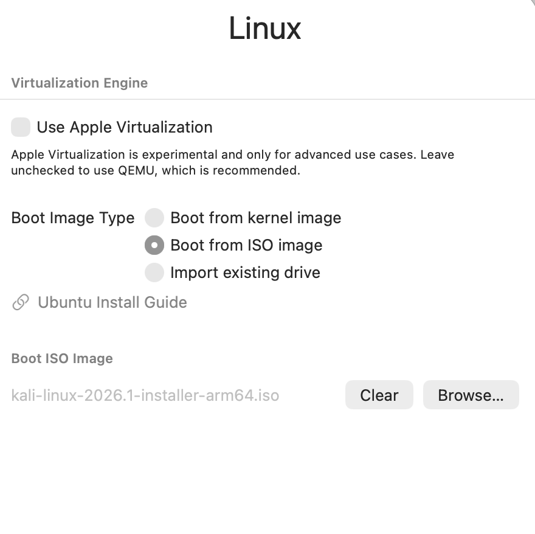

### Step 3: Hardware Allocation
Configured the virtual machine with appropriate resource constraints:
- **6 GB RAM**: Sufficient for running Kali tools and multiple applications simultaneously
- **CPU Cores**: Utilized all available cores for optimal performance
- **64 GB Storage**: Adequate space for Kali installation, tools, and testing data
- **Display Output**: Enabled for GUI-based tool usage and system management

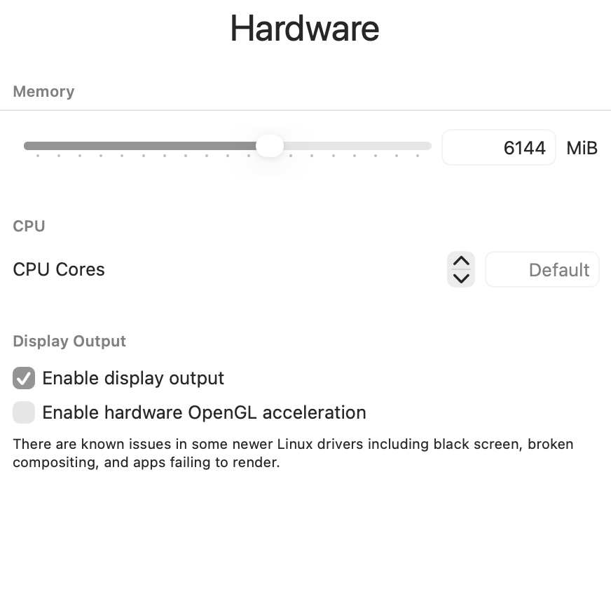

### Step 4: Storage Configuration
Allocated 64 GB of virtual disk space for the VM, providing adequate storage for:
- Kali Linux operating system
- Pre-installed penetration testing tools
- Additional software and utilities
- Test data and lab artifacts

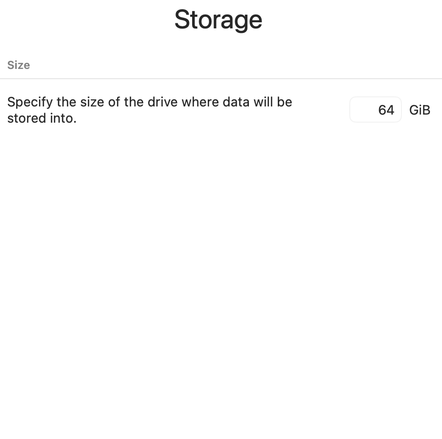

### Step 5: Shared Directory Setup
Configured optional shared directory access between host and guest systems for easy file transfer and lab data management.

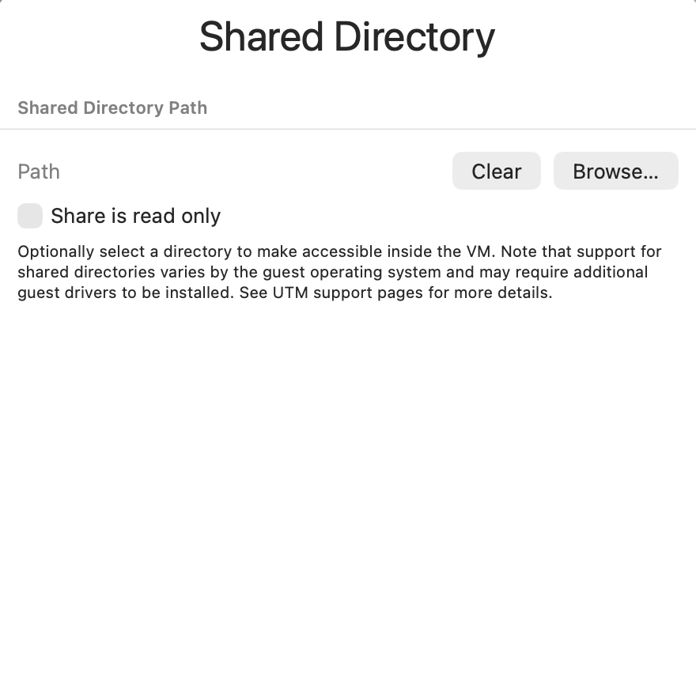

### Step 6: Operating System Selection
**Kali Linux 2026.1** was chosen because:
- Industry-standard penetration testing distribution
- Pre-installed security tools (Metasploit, Wireshark, Burp Suite, etc.)
- Regular security updates and community support
- ARM64 architecture support for modern systems
- Ideal for learning cybersecurity fundamentals and advanced techniques

### Step 7: Virtual Machine Summary
Final VM configuration before installation:

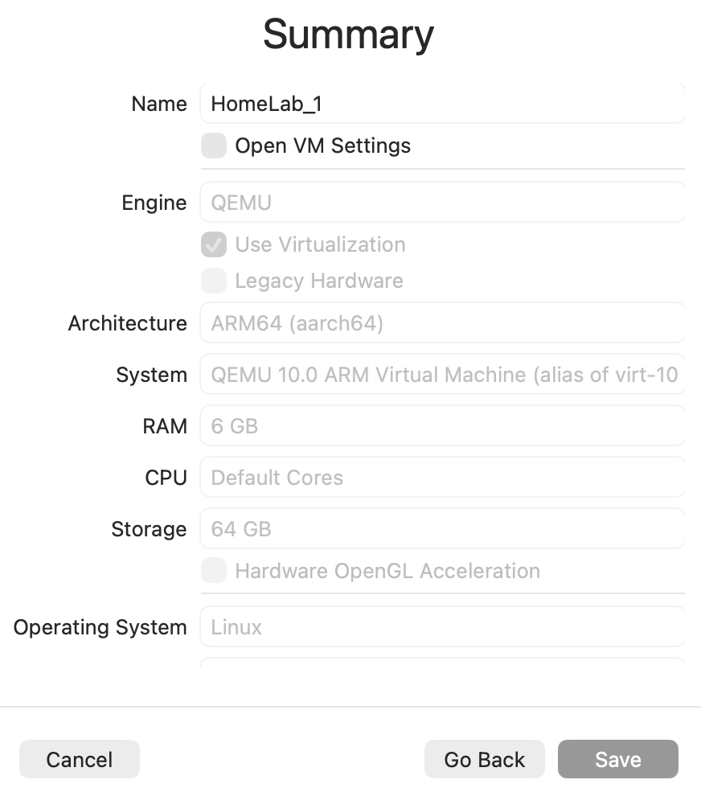

**Configuration Summary:**
- Name: HomeLab_1
- Engine: QEMU (10.0 ARM Virtual Machine)
- RAM: 6 GB
- CPU: Default Cores
- Storage: 64 GB
- OS: Linux (Kali)
- Display: Enabled with virtualization

### Step 8: Installation Configuration

#### Terminal Configuration
Configure terminal settings for the Kali Linux environment with custom fonts, colors, and themes:

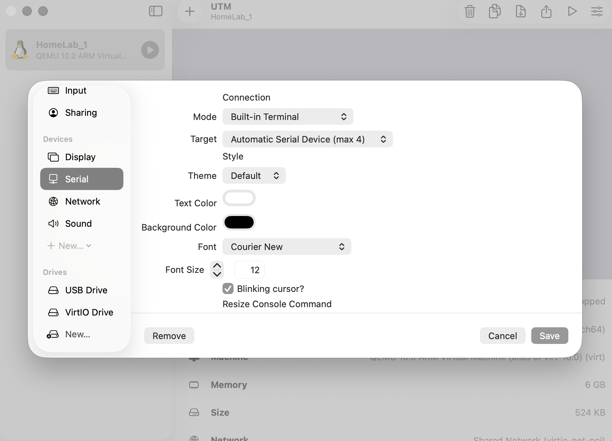

#### Hostname Configuration
Set a unique hostname for system identification on networks - essential for multi-VM environments and lab scenarios:

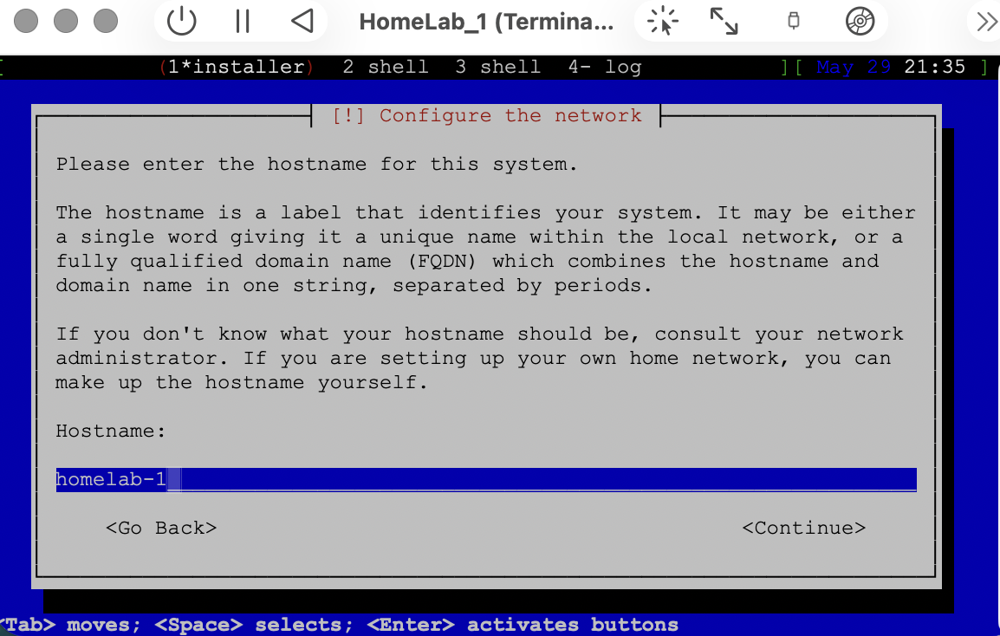

#### User Account Setup
Create a non-root user account for daily operations, maintaining security best practices:

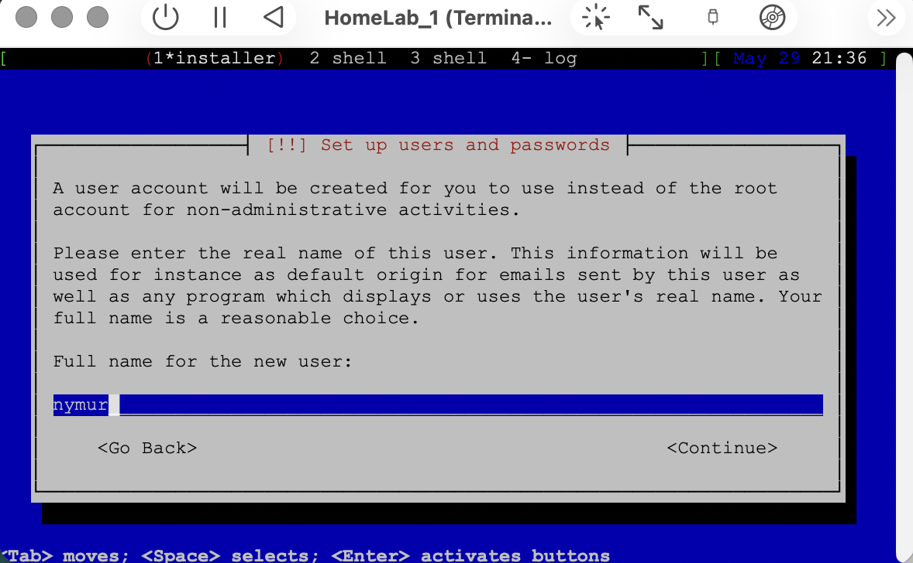

**Best Practices Applied:**
- Non-root user for daily operations
- User has sudo privileges for administrative tasks
- Separate from root account for accountability and security

#### Disk Partitioning
Configure disk layout during installation with appropriate partitions:

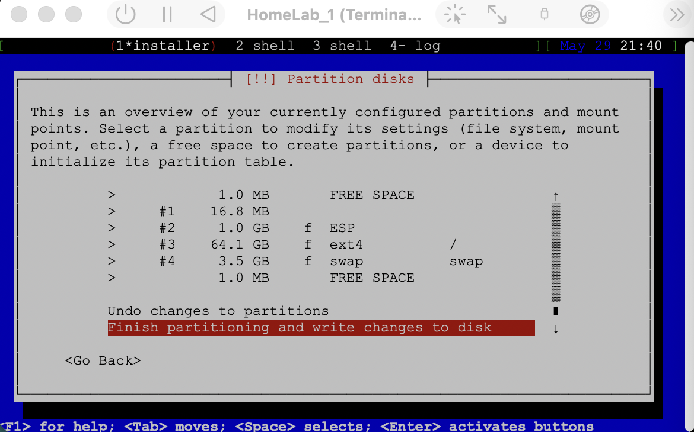

**Partition Strategy:**
- Separate partitions for OS, home directory, and swap space
- Enables proper filesystem management and recovery

#### Desktop Environment Selection
Select Xfce for lightweight performance optimized for virtualized environments:

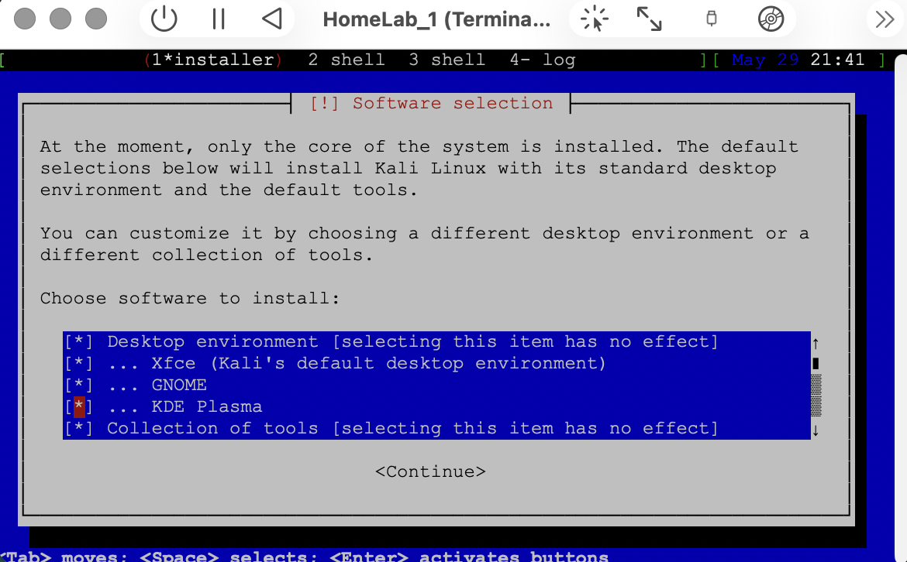

**Why Xfce?**
- Lightweight and responsive in VMs
- Good balance of functionality and performance
- GNOME/KDE alternatives too resource-heavy for VM

#### Login Manager Configuration
Configure GDM3 for graphical login interface:

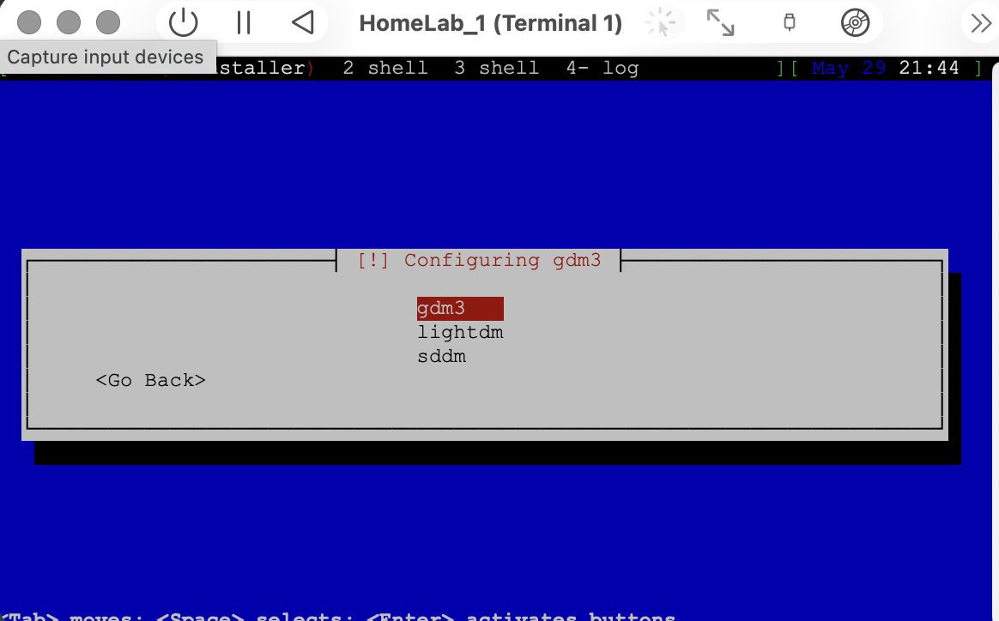

- Set default desktop environment
- Customized terminal settings (fonts, colors, themes)

### Step 9: Final Installation & Desktop

Kali Linux successfully installed and running in the homelab environment:

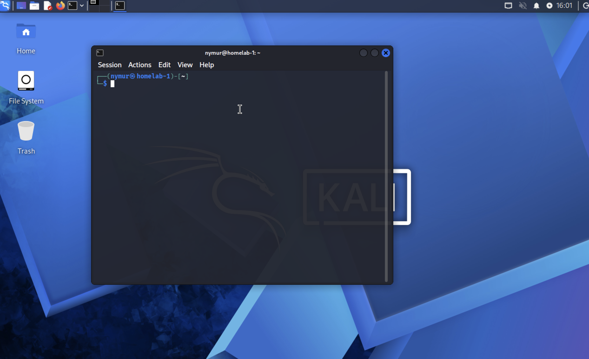

The desktop environment is now ready for:
- Security tool usage and exploration
- Network analysis and penetration testing
- Vulnerability assessment and exploitation practice
- System administration and configuration exercises

### Step 10: File Sharing (Optional)
- Configured shared directory support between host and guest
- Allows seamless file transfer between host and VM
- Read-only option available for security
- Requires guest additions/drivers for full functionality

## Security Considerations

### Isolation
- Homelab VM is completely isolated from production systems
- Network configuration allows controlled connectivity
- Snapshots enable safe experimentation and easy rollback

### Backup Strategy
- Regular snapshots of stable VM states
- Allows quick recovery from misconfiguration or security incidents
- Enables parallel testing scenarios

### Resource Management
- Hardware resource limits prevent VM from consuming entire host system
- Maintains host system stability during lab activities

## Tools & Capabilities Available

With Kali Linux installed, the homelab provides access to:

**Network Analysis**
- Wireshark (packet analysis)
- Nmap (network scanning)
- tcpdump (network traffic capture)

**Penetration Testing**
- Metasploit Framework (exploitation platform)
- Burp Suite (web application testing)
- SQLmap (SQL injection testing)

**Vulnerability Assessment**
- OpenVAS (vulnerability scanning)
- Nikto (web server scanning)

**Cryptography & Analysis**
- John the Ripper (password cracking)
- Hashcat (GPU-accelerated cracking)
- OpenSSL utilities

**System Administration**
- Full CLI and GUI tools for system management
- Package managers for installing additional tools

## Learning Outcomes & Skills Developed

### Technical Skills
✅ Virtualization and hypervisor management  
✅ Linux system administration and configuration  
✅ Network configuration and management  
✅ Security tool proficiency  
✅ Hands-on penetration testing methodology  

### Knowledge Areas
✅ Understanding of isolated testing environments  
✅ Best practices for lab setup and management  
✅ Security tool ecosystem familiarity  
✅ Linux command-line proficiency  
✅ Cybersecurity fundamentals  

## Future Enhancements

- **Network Segmentation**: Create multiple VMs in different network segments
- **Active Directory Lab**: Add Windows domain for realistic penetration testing scenarios
- **Logging & Monitoring**: Implement SIEM tools for security event analysis
- **Automation**: Script VM deployment and configuration using Infrastructure as Code
- **CTF Challenges**: Use homelab for Capture The Flag competitions and vulnerability assessment

## Relevance to Cybersecurity Careers

This homelab demonstrates several key competencies valued by employers:

1. **Self-Directed Learning**: Initiative to build practical security skills independently
2. **Technical Foundation**: Understanding of virtualization, Linux, and security tools
3. **Hands-On Experience**: Real practical experience with industry-standard tools
4. **Lab Environment Design**: Ability to create controlled testing environments
5. **Problem Solving**: Troubleshooting installation and configuration challenges

Employers in SOC analyst, penetration tester, and security engineer roles specifically look for candidates who have hands-on experience building and using security labs.

## Getting Started with Your Homelab

### Next Steps
1. Practice common Kali tools and their usage
2. Complete vulnerability scanning exercises
3. Practice exploitation techniques in controlled scenarios
4. Document findings and create lab reports
5. Build towards completing CTF challenges and certifications (Security+, CEH, OSCP)

### Recommended Exercises
- Network scanning and enumeration
- Web application vulnerability assessment
- Password cracking and hash analysis
- Social engineering awareness training
- Incident response simulations

---

**Created**: May 30, 2026  
**Purpose**: Educational cybersecurity homelab for skill development  
**Audience**: Security professionals, students, and cybersecurity enthusiasts
